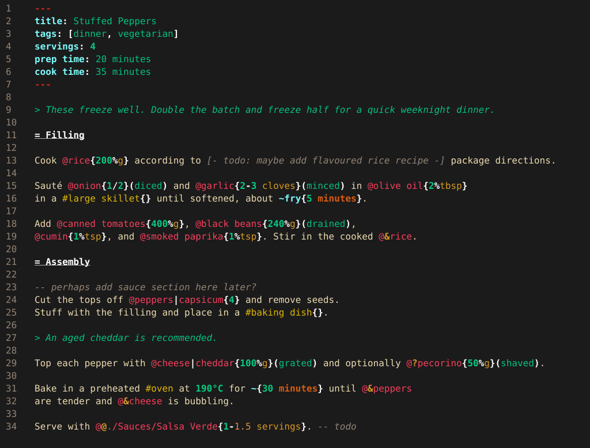

# tree-sitter-cooklang

A [Cooklang](https://cooklang.org) grammar for the [Tree-sitter](https://github.com/tree-sitter/tree-sitter) parser generator.

> [!NOTE]
> This project is not affiliated with or endorsed by the Cooklang project or its maintainers.

> [!TIP]
> [tree-sitter-yaml](https://github.com/tree-sitter-grammars/tree-sitter-yaml) is also required to enable YAML frontmatter metadata parsing.

## Contents
- [Features](#features)
    - [Base syntax](#base-syntax)
    - [Extended syntax](#extended-syntax)
    - [Scheme files](#scheme-files)
    - [Language bindings](#language-bindings)
- [Development](#development)
    - [Testing](#testing)
    - [Benchmarking](#benchmarking)
- [Example](#example)
    - [Syntax highlighting](#syntax-highlighting)
    - [Concrete syntax tree](#concrete-syntax-tree)
- [References](#references)

## Features
### Base syntax
The grammar implements the current Cooklang language specification[^2], including:

- **Single and multi-word definitions** (incl. `ingredient`, `cookware`, `timer`)
- **Delimited `step` and `note` nodes with multi-line support**
- **Metadata** (legacy directive syntax & YAML[^7] frontmatter)
- **Unicode-aware whitespace handling**
- **Hierarchical sections** (with content assigned as children of the corresponding section headings)
- **Typed numeric tokens** (`integer`, `decimal`) 
- **Structured quantities** (`fractional`)
- **Comments** (in-line, multi-line, and block comments within plain text)

#### Deviations from specification
__In-line block comments are recognised only where plain text is valid.__ Because tree-sitter performs incremental parsing, comments cannot simply be stripped from the input before lexing. Supporting block comments within structured constructs such as ingredients, cookware, and timers therefore requires substantially more complex grammar and scanner logic. As an implementation trade-off, this parser recognises block comments only where plain text is valid.

Aside from comments, this grammar is intentionally more permissive than the _cooklang-rs_[^3] reference parser and performs limited semantic validation. 
Where practical, syntactically recoverable constructs are parsed instead of rejected, allowing editor features such as syntax highlighting and incremental parsing to continue operating on incomplete or non-conforming documents.

### Extended syntax 
The following Cooklang language extensions[^3] are currently supported:

- **Modes**
- **Ingredient modifiers** (`@`, `&`, `?`, `+`, `-`)
- **Intermediate preparations**
- **Component alias** (ingredient & cookware)
- **Advanced units**
- **Range values** (with mixed integer & decimal support)
- **Timer requires time** (rendered as plain text)
- **Temperature** (unicode-aware symbol parsing and some plain English expressions)

### Scheme files
The following scheme files[^8] are included in [./queries](queries/) to facilitate editor integrations and syntax highlight.

| File | Content |
| ---- | ------- |
| [highlights.scm](queries/highlights.scm)  | syntax highlighting & spell check  |
| [folds.scm](queries/folds.scm)            | code folding                       |
| [injections.scm](queries/injections.scm)  | YAML[^7] language injection        |

### Language bindings
Bindings are available under [./bindings](bindings/) for C, Go, Java, JavaScript, Python, Rust, Swift, and Zig.

## Development

### Testing [^4]
The repository contains a several test suites located within [./test/corpus].

> [!TIP]
> Running the tests requires [tree-sitter-cli](https://github.com/tree-sitter/tree-sitter/blob/master/crates/cli/README.md).

```sh
# runs all tests in the corpus
tree-sitter test

# fuzzing must exclude cst-based tests
tree-sitter fuzz --exclude "\b\w+_cst\b"
```

| File | Content |
| ---- | ------- |
| `canonical.txt`     | adapted from the cooklang-rs `canonical.yml` test file [^5]. |
| `canonical_cst.txt` | same inputs as above, but shows captured content as a concrete syntax tree. |
| `additional.txt`    | additional tests covering notes, section headings, multiline steps, and more complex syntax combinations. |
| `extensions.txt`    | tests covering extended language features [^3]. |

### Benchmarking
Benchmarks are also included to measure parser performance, adapted from the benchmarking implementation and corpus in `cooklang-rs` [^6].

> [!TIP]
> Running the benchmarks requires [cargo](https://doc.rust-lang.org/cargo/getting-started/installation.html).

Run them with:
```sh
cargo bench --manifest-path benchmark/Cargo.toml
```
## Example

### Syntax highlighting 


### Concrete syntax tree
```
0:0   - 37:0    recipe
0:0   - 6:3       frontmatter
0:0   - 1:0         metadata_start
0:0   - 0:4           `---\n`
1:0   - 6:0         content: metadata_content
1:0   - 1:23          `title: Stuffed Peppers\n`
2:0   - 2:27          `tags: [dinner, vegetarian]\n`
3:0   - 3:12          `servings: 4\n`
4:0   - 4:22          `prep time: 20 minutes\n`
5:0   - 5:22          `cook time: 35 minutes\n`
6:0   - 6:3         metadata_end `---`
8:0   - 9:0       directive
8:0   - 8:2         ">>"
8:3   - 8:25        mode
8:3   - 8:4           "["
8:4   - 8:13          key: identifier `duplicate`
8:13  - 8:14          "]"
8:14  - 8:15          ":"
8:16  - 8:25          value: string `reference`
10:0  - 11:0      note
10:0  - 10:2        ">"
10:2  - 10:83       text `These freeze well. Double the batch and freeze half for a quick weeknight dinner.`
12:0  - 24:0      section
12:0  - 12:9        heading
12:2  - 12:9          name: text `Filling`
14:0  - 15:0        step
14:0  - 14:5          text `Cook `
14:5  - 14:17         ingredient
14:6  - 14:10           name: identifier `rice`
14:10 - 14:11           "{"
14:11 - 14:14           quantity: integer `200`
14:14 - 14:15           "%"
14:15 - 14:16           unit: unit `g`
14:16 - 14:17           "}"
14:18 - 14:31         text `according to `
14:31 - 14:65         comment `[- todo: add garlic rice recipe -]`
14:66 - 14:85         text `package directions.`
16:0  - 18:0        step
16:0  - 16:7          text `Sauté `
16:7  - 16:25         ingredient
16:8  - 16:13           name: identifier `onion`
16:13 - 16:14           "{"
16:14 - 16:17           quantity: fractional
16:14 - 16:15             left: integer `1`
16:15 - 16:16             "/"
16:16 - 16:17             right: integer `2`
16:17 - 16:19           "}("
16:19 - 16:24           preparation: string `diced`
16:24 - 16:25           ")"
16:26 - 16:30         text `and `
16:30 - 16:57         ingredient
16:31 - 16:37           name: identifier `garlic`
16:37 - 16:38           "{"
16:38 - 16:41           quantity: range
16:38 - 16:39             left: integer `2`
16:39 - 16:40             "-"
16:40 - 16:41             right: integer `3`
16:42 - 16:48           unit: unit `cloves`
16:48 - 16:50           "}("
16:50 - 16:56           preparation: string `minced`
16:56 - 16:57           ")"
16:58 - 16:61         text `in `
16:61 - 16:79         ingredient
16:62 - 16:71           name: identifier `olive oil`
16:71 - 16:72           "{"
16:72 - 16:73           quantity: integer `2`
16:73 - 16:74           "%"
16:74 - 16:78           unit: unit `tbsp`
16:78 - 16:79           "}"
17:0  - 17:5          text `in a `
17:5  - 17:21         cookware
17:5  - 17:6            "#"
17:6  - 17:19           name: identifier `large skillet`
17:19 - 17:20           "{"
17:20 - 17:21           "}"
17:22 - 17:44         text `until softened, about `
17:44 - 17:59         timer
17:44 - 17:45           "~"
17:45 - 17:48           name: identifier `fry`
17:48 - 17:49           "{"
17:49 - 17:50           quantity: integer `5`
17:51 - 17:58           unit: unit `minutes`
17:58 - 17:59           "}"
17:59 - 17:60         text `.`
19:0  - 21:0        step
19:0  - 19:4          text `Add `
19:4  - 19:27         ingredient
19:5  - 19:20           name: identifier `canned tomatoes`
19:20 - 19:21           "{"
19:21 - 19:24           quantity: integer `400`
19:24 - 19:25           "%"
19:25 - 19:26           unit: unit `g`
19:26 - 19:27           "}"
19:27 - 19:29         text `, `
19:29 - 19:57         ingredient
19:30 - 19:41           name: identifier `black beans`
19:41 - 19:42           "{"
19:42 - 19:45           quantity: integer `240`
19:45 - 19:46           "%"
19:46 - 19:47           unit: unit `g`
19:47 - 19:49           "}("
19:49 - 19:56           preparation: string `drained`
19:56 - 19:57           ")"
19:57 - 19:58         text `,`
20:0  - 20:13         ingredient
20:1  - 20:6            name: identifier `cumin`
20:6  - 20:7            "{"
20:7  - 20:8            quantity: integer `1`
20:8  - 20:9            "%"
20:9  - 20:12           unit: unit `tsp`
20:12 - 20:13           "}"
20:13 - 20:19         text `, and `
20:19 - 20:41         ingredient
20:20 - 20:34           name: identifier `smoked paprika`
20:34 - 20:35           "{"
20:35 - 20:36           quantity: integer `1`
20:36 - 20:37           "%"
20:37 - 20:40           unit: unit `tsp`
20:40 - 20:41           "}"
20:41 - 20:55         text `. Stir in the `
20:55 - 20:73         ingredient
20:56 - 20:57           "&"
20:57 - 20:58           "("
20:58 - 20:59           step_reference
20:58 - 20:59             absolute_reference
20:58 - 20:59               target: integer `1`
20:59 - 20:60           ")"
20:60 - 20:71           name: identifier `cooked rice`
20:71 - 20:72           "{"
20:72 - 20:73           "}"
20:73 - 20:74         text `.`
22:0  - 22:40       comment_line `-- perhaps add sauce section here later?`
24:0  - 37:0      section
24:0  - 24:29       heading
24:2  - 24:11         name: text `Assembly `
24:11 - 24:29         comment `-- needs some work`
26:0  - 28:0        step
26:0  - 26:17         text `Cut the tops off `
26:17 - 26:37         ingredient
26:18 - 26:25           name: identifier `peppers`
26:25 - 26:26           "|"
26:26 - 26:34           alias: identifier `capsicum`
26:34 - 26:35           "{"
26:35 - 26:36           quantity: integer `4`
26:36 - 26:37           "}"
26:38 - 26:55         text `and remove seeds.`
27:0  - 27:15         text `Stuff with the `
27:15 - 27:28         ingredient
27:16 - 27:17           "&"
27:17 - 27:18           "("
27:18 - 27:20           section_reference
27:18 - 27:19             "="
27:19 - 27:20             absolute_reference
27:19 - 27:20               target: integer `1`
27:20 - 27:21           ")"
27:21 - 27:28           name: identifier `filling`
27:29 - 27:44         text `and place in a `
27:44 - 27:58         cookware
27:44 - 27:45           "#"
27:45 - 27:56           name: identifier `baking dish`
27:56 - 27:57           "{"
27:57 - 27:58           "}"
27:58 - 27:59         text `.`
29:0  - 30:0        note
29:0  - 29:2          ">"
29:2  - 29:33         text `An aged cheddar is recommended.`
31:0  - 32:0        step
31:0  - 31:21         text `Top each pepper with `
31:21 - 31:51         ingredient
31:22 - 31:28           name: identifier `cheese`
31:28 - 31:29           "|"
31:29 - 31:36           alias: identifier `cheddar`
31:36 - 31:37           "{"
31:37 - 31:40           quantity: integer `100`
31:40 - 31:41           "%"
31:41 - 31:42           unit: unit `g`
31:42 - 31:44           "}("
31:44 - 31:50           preparation: string `grated`
31:50 - 31:51           ")"
31:52 - 31:67         text `and optionally `
31:67 - 31:91         ingredient
31:68 - 31:69           "?"
31:69 - 31:77           name: identifier `pecorino`
31:77 - 31:78           "{"
31:78 - 31:80           quantity: integer `50`
31:80 - 31:81           "%"
31:81 - 31:82           unit: unit `g`
31:82 - 31:84           "}("
31:84 - 31:90           preparation: string `shaved`
31:90 - 31:91           ")"
31:91 - 31:92         text `.`
33:0  - 35:0        step
33:0  - 33:20         text `Bake in a preheated `
33:20 - 33:25         cookware
33:20 - 33:21           "#"
33:21 - 33:25           name: identifier `oven`
33:26 - 33:29         text `at `
33:29 - 33:35         temperature
33:29 - 33:32           quantity: integer `190`
33:34 - 33:35           scale: scale `C`
33:36 - 33:40         text `for `
33:40 - 33:53         timer
33:40 - 33:41           "~"
33:41 - 33:42           "{"
33:42 - 33:44           quantity: integer `30`
33:45 - 33:52           unit: unit `minutes`
33:52 - 33:53           "}"
33:54 - 33:60         text `until `
33:60 - 33:69         ingredient
33:61 - 33:62           "&"
33:62 - 33:69           target: identifier `peppers`
33:69 - 33:70         text `.`
34:0  - 34:15         text `are tender and `
34:15 - 34:23         ingredient
34:16 - 34:17           "&"
34:17 - 34:23           target: identifier `cheese`
34:24 - 34:36         text `is bubbling.`
36:0  - 37:0        step
36:0  - 36:11         text `Serve with `
36:11 - 36:49         ingredient
36:12 - 36:13           "@"
36:13 - 36:33           name: identifier `./Sauces/Salsa Verde`
36:33 - 36:34           "{"
36:34 - 36:39           quantity: range
36:34 - 36:35             left: integer `1`
36:35 - 36:36             "-"
36:36 - 36:39             right: decimal `1.5`
36:40 - 36:48           unit: unit `servings`
36:48 - 36:49           "}"
36:49 - 36:51         text `. `
36:51 - 36:58         comment `-- todo`
```

## References
[^2]: [Cooklang specification](https://github.com/cooklang/spec)
[^3]: [cooklang-rs Extensions](https://github.com/cooklang/cooklang-rs/blob/main/extensions.md)
[^4]: [tree-sitter: Writing tests](https://tree-sitter.github.io/tree-sitter/creating-parsers/5-writing-tests.html)
[^5]: [cooklang-rs Tests](https://github.com/cooklang/cooklang-rs/blob/94540020fe54c96fc7eb0370b66c6d36d54256b6/tests/canonical.yaml)
[^6]: [cooklang-rs Benchmarks](https://github.com/cooklang/cooklang-rs/tree/94540020fe54c96fc7eb0370b66c6d36d54256b6/benches)
[^7]: YAML injection requires [tree-sitter-yaml](https://github.com/tree-sitter-grammars/tree-sitter-yaml)
[^8]: [tree-sitter: Query syntax](https://tree-sitter.github.io/tree-sitter/using-parsers/queries/1-syntax.html)
